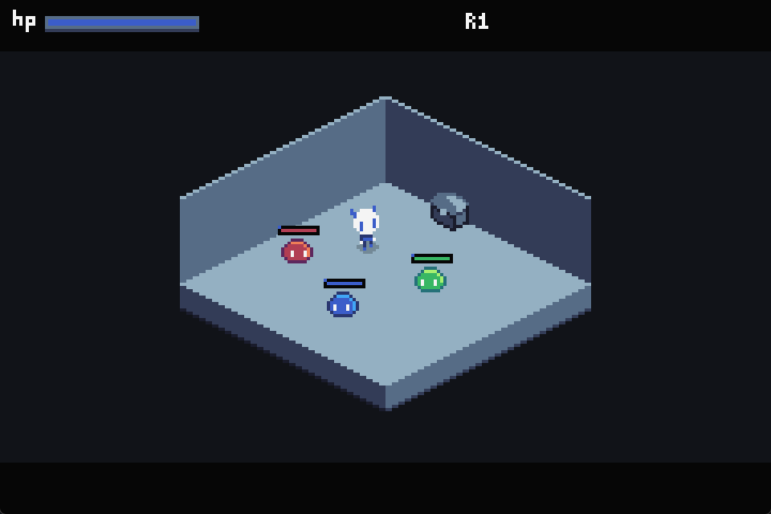

# TinyDemons



TinyDemons is a compact pixel-art isometric action game built in Godot. Explore dungeon rooms, fight colorful slime enemies, manage your health, and meet the cloaked guide beside the rest fire at the start of each run.

Current gameplay includes:

- Directional attacks with multi-target damage sharing and readable hit feedback.
- Short roll movement with animation timing and collision-safe movement.
- Slime enemies with wandering, targeting, and persistent combat aggro.
- Player, target, and enemy overhead health bars with damage-transition highlights.
- Perspective-aware collision, attack guides, knockback, and brief hitstop.
- Pixel-based attack, slime splat, chest, and title-screen fizzle effects.
- Room progression, chest rewards, gold tracking, and restart flow.
- Elemental Chroma casting, Soul pickups, elemental binding, and flame fusion.
- Six-stat progression, six-slot equipment, rarity effects, and gear drops.
- An authored player HUD with radial ability cooldowns and device-aware prompts.
- Responsive desktop/browser presentation with touch controls and gamepad input.

## Current Focus

The active gameplay work is the **Elemental Chroma system**: starter-flame
attunement, Gray/elemental state, Chroma pickups and casting, and mandatory
elemental puzzle rooms. In parallel, the codebase is entering a staged
feature-oriented refactor so these systems have typed owners instead of
continuing to grow inside the gameplay coordinator.

The next combat design slice is documented in
[`docs/elemental-slimes-and-combat-plan.md`](docs/elemental-slimes-and-combat-plan.md):
elemental slime variants, the custom scaled Gen-III matchup table, and
element-colored damage feedback.

The **web port** (browser build with touch controls, gamepad peripherals, and
last-input-device auto-detection) is implemented and tracked in
[`docs/web-port-implementation-plan.md`](docs/web-port-implementation-plan.md);
desktop remains the primary target and both share this codebase.

The **modular display and settings** slice (adaptive `FULL` landscape mode plus
3:2/16:10/16:9 presets, with the void and decorative bars expanding to fit,
title/pause settings panel with fullscreen and volume sliders, pause
quit-to-title) is implemented and tracked in
[`docs/modular-display-and-settings-plan.md`](docs/modular-display-and-settings-plan.md).

The current combat slice adds the scene-authored Spin Attack and held-button
charge attack; its editor hitbox workflow and tuning contract are tracked in
[`docs/spin-and-charge-attacks-plan.md`](docs/spin-and-charge-attacks-plan.md).

The implemented progression/UI redesign is documented in
[`docs/ffiii-inspired-stats-and-menu-implementation-plan.md`](docs/ffiii-inspired-stats-and-menu-implementation-plan.md):
six manually allocated attributes (STR/AGI/VIT/INT/MND/DEF), typed physical and
magic combat paths, INT-driven Imbue strength, save migration, and
FFIII-inspired menu layouts using Tiny Demons' own visual language.

The next progression content slice is the approved six-slot equipment
catalogue. Its documentation-first boundary is in
[`docs/gear-catalogue-spec.md`](docs/gear-catalogue-spec.md), with the authored
44-base list, effect contracts, drop rules, and implementation sequence in the
linked companion documents. Head and Arm are approved additions; future weapon
families remain documented extension points until their combat contracts exist.

Start with [`docs/AUDIT.md`](docs/AUDIT.md) for the current findings and phase
status, then [`docs/refactor-route.md`](docs/refactor-route.md) for the accepted
execution plan. The completed Combat & Economy work remains documented in
[`docs/combat-economy-overhaul.md`](docs/combat-economy-overhaul.md).

## Project Layout

- `project.godot` - the Godot project root (this folder is the project)
- `assets/` `scenes/` `scripts/` `shaders/` `tests/` - the Godot project
- `Artwork/` - exported and source art files (source, not imported by Godot)
- `Mockups/` - reference mockups
- `screenshots/` - game screenshots
- `docs/` - audit, plans, tuning index, feature designs, and smoke checklist
- `docs/game-screenshot.png` - first-room gameplay screenshot used in this README

## Running The Project

Open `project.godot` in Godot 4.7 and run the main scene. The project is configured for a small nearest-neighbor pixel-art presentation, so keep texture filtering and integer-like scaling intact when changing the display settings.

When the Godot MCP editor peer is active, perform verification through MCP:
scene inspection, script diagnostics, playtests, screenshots, and runtime
logs. Do not run the full standalone smoke runner from that session. It starts
one separate Godot process per registered test (currently around 90); a single
headless renderer failure can create repeated Windows memory-error dialogs.

Run the headless smoke suite only as a supervised standalone check, with no MCP
Godot runtime active. Start with one focused test before using the full runner:

```powershell
# Focused check
& "C:\Development\Tiny-Demons\Godot_v4.7.1-stable_win64.exe\Godot_v4.7.1-stable_win64_console.exe" --headless --path . --log-file ".godot_user/focused-smoke.log" -s res://tests/player_hud_scene_smoke.gd

# Full suite — standalone/supervised only
pwsh -ExecutionPolicy Bypass -File tests/run_all_smoke.ps1
```

If Windows memory-error dialogs start repeating, stop the smoke runner and
terminate only the `Godot_v4.7.1-stable_win64_console` worker processes. Keep
the main editor/MCP process alive if it remains healthy.

Display settings are device-wide and can be changed from SETTINGS on the title
screen or from the pause menu. Available options are aspect (`FULL`, 3:2,
16:10, or 16:9), fullscreen, pixel-perfect scaling, music volume, and SFX
volume. `FULL` is the default and follows the live landscape browser/window
viewport while keeping the 160 px logical height.

## Controls

Bindings are defined in the **Input Map** (Project Settings > Input Map) and
remappable in-editor. Defaults:

- Move: Arrow keys / WASD / left stick / D-pad
- Attack: `J` / Space / controller X
- Roll: `K` / controller A
- Target lock: `Q` / Tab / controller right shoulder or right trigger
- Guard: `L` / Shift / controller left shoulder or left trigger
- Interact / confirm: `E` / Enter / controller B (PlayStation Circle)
- Cancel/back: `X` / Escape / controller A (PlayStation Cross)
- Pause: Escape / controller Start

## Web build

Current game version: **0.1.04**. Every push to `main` must increment the
patch version by at least `0.0.01`; update the in-game title-menu version and
this README in the same commit.

The browser build is published to
[GitHub Pages](https://whynchu.github.io/TinyDemons/) from `main`. Pull
requests run the Web export and upload a review artifact without publishing;
only a `main` push (or a manual workflow run on `main`) deploys the public
site. The workflow is [`.github/workflows/web-pages.yml`](.github/workflows/web-pages.yml).
In repository settings, set Pages' publishing source to **GitHub Actions** once
before the first deployment.

On a touch device, the virtual stick and action controls appear after touch
input. Keyboard, mouse, and gamepad input remain available, and prompts follow
the last device used. To validate the export locally after installing the
matching Godot 4.7.1 Web template:

```powershell
pwsh -ExecutionPolicy Bypass -File tests/web_export_smoke.ps1 -RequireExport
```
