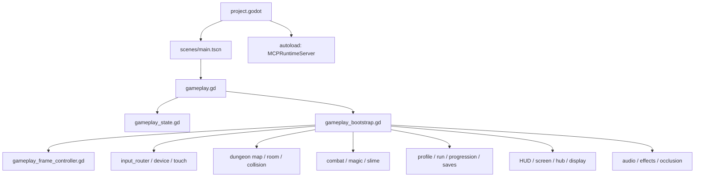
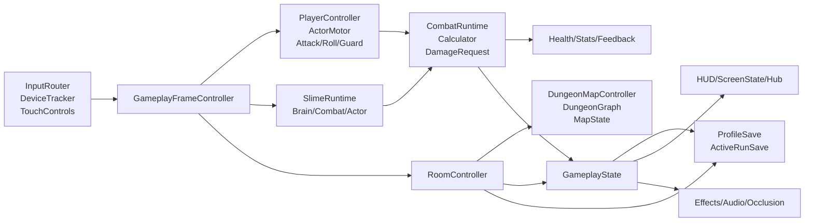
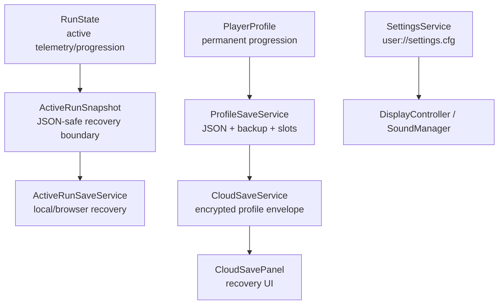

# Tiny Demons Repository Map

Status: initial full map; improve as ownership is verified

Map date: 2026-09-07

This document is the practical navigation map for the repository. It describes
the current worktree, not an idealized future architecture. Existing audit and
refactor documents remain the decision records; this file points to the code
that actually runs.

## How To Use This Map

When changing a feature:

1. Find the feature in the ownership table.
2. Start with the listed primary owner.
3. Read its state authority and presentation dependencies.
4. Find the listed tests before changing behavior.
5. Check the cross-cutting seams before adding coordinator logic.
6. Update this map when ownership or runtime boundaries change.

When debugging a player-visible issue, start with the relevant vertical slice
below instead of searching the entire repository.

## Repository Shape

The authoritative Godot project is `TinyDemons/`. The parent workspace contains
research, mockups, screenshots, SFX archives, and a local Godot installation;
those are not assumed to be runtime dependencies.

```text
TinyDemons/
├── project.godot                 project settings, input map, main scene
├── export_presets.cfg            Web export configuration
├── scenes/                       authored, runtime, debug, and preview scenes
├── scripts/                      runtime owners, data models, tools, previews
├── assets/                       artwork, audio, imported/source resources
├── shaders/                      runtime shaders
├── tests/                        smoke, scene, contract, and generator tests
├── tools/                        analysis, export, audio, and validation tools
├── addons/                       Godot MCP editor/runtime toolkit
└── docs/                         architecture, design, audit, and plans
```

### Current tracked scale

Measured from Git-tracked files on 2026-09-07:

| Surface | Count | Interpretation |
|---|---:|---|
| GDScript files | 384 | Includes runtime, tests, tools, previews, and addon code |
| Scenes | 19 | Includes production, debug, authoring, and preview scenes |
| Test scripts | 114 | Mostly smoke/contract tests; not all are full integration tests |
| Markdown files | 86 | Active plans, historical decisions, reference, and addon docs |

The current worktree also contains uncommitted R7 puzzle-generation changes and
the analysis documents created during this mapping effort. Do not treat the
worktree as a clean release baseline.

## Runtime Entry And Composition



### Entry points

| Entry point | Location | Role |
|---|---|---|
| Project boot | `project.godot` | Selects `res://scenes/main.tscn` |
| Gameplay root | `scenes/main.tscn` | Root `Node2D`; embeds map, actors, guides, and UI |
| Root script | `scripts/gameplay.gd` | Extends `GameplayState`; starts bootstrap and web diagnostics |
| Runtime composition | `scripts/gameplay_bootstrap.gd` | Instantiates runtime controllers and connects signals |
| Frame schedule | `scripts/gameplay_frame_controller.gd` | Orders input, simulation, contact, damage, presentation, transitions |
| Tooling autoload | `addons/godot_mcp_toolkit/runtime/mcp_runtime_server.gd` | MCP runtime/editor bridge, not gameplay ownership |

### Explicit frame order

```text
input
  -> simulation
  -> contact_resolution
  -> damage_and_progression
  -> presentation
  -> transitions
```

This is a deliberate architectural boundary. New systems should be wired into
this schedule rather than adding unrelated `_process()` loops.

## Feature Ownership Map

| Feature | Primary owner | State/data authority | Presentation/support | First tests to inspect |
|---|---|---|---|---|
| Boot and run loop | `gameplay_bootstrap.gd`, `gameplay.gd` | `gameplay_state.gd` | `main.tscn`, frame controller | `title_boot_scene_smoke.gd`, `composition_root_baseline_smoke.gd` |
| Frame ordering | `gameplay_frame_controller.gd` | phase constants and root runtime state | all runtime controllers | `frame_time_smoke.gd`, `composition_root_baseline_smoke.gd` |
| Input snapshot | `input_router.gd` | per-frame merged input snapshot | device prompts, touch controls | `input_router_smoke.gd`, `input_device_tracker_smoke.gd` |
| Touch controls | `touch_controls_layer.gd` | touch provider state | responsive touch layer | `touch_controls_smoke.gd`, `touch_menu_scroll_smoke.gd` |
| Player movement | `player_controller.gd`, `actor_motor.gd` | player runtime fields | animation, roll, geometry | `run_locomotion_smoke.gd`, `speed_scale_smoke.gd` |
| Player attacks | `player_attack_component.gd` | attack component plus root combat flags | hitbox guides, animation, effects | `typed_combat_path_smoke.gd`, `spin_charge_scene_smoke.gd` |
| Actor geometry | `actor_geometry.gd`, `actor_collision_system.gd` | shared geometry calculations | occlusion, targeting, debug guides | `actor_geometry_smoke.gd`, `wall_socket_geometry_smoke.gd` |
| Slime behavior | `slime_brain.gd`, `slime_combat_component.gd`, `slime_actor.gd` | slime components and health | animation, visual, health presenter | `slime_spawn_smoke.gd`, `enemy_room_engagement_smoke.gd` |
| Combat calculation | `combat_runtime_controller.gd`, `combat_calculator.gd` | stats/equipment snapshots and tuning | damage feedback, momentum | `elemental_damage_smoke.gd`, `typed_damage_feedback_smoke.gd` |
| Magic/projectiles | `magic_runtime_controller.gd`, `magic_projectile_controller.gd` | Chroma and projectile runtime state | projectile/effects layer | `imbue_spell_scene_smoke.gd`, `chroma_projectile_scene_smoke.gd` |
| Chroma/elements | `player_chroma_component.gd`, `element_catalog.gd` | player Chroma/profile bind state | pickups, magic, palette/effects | `chroma_state_smoke.gd`, `element_catalog_smoke.gd` |
| Room content | `room_controller.gd` | `room_states` dictionaries | room scenes, enemy roster, chest | `enemy_room_entrance_scene_smoke.gd`, `treasure_chest_persistence_smoke.gd` |
| Dungeon topology | `dungeon_graph.gd`, `dungeon_map_controller.gd` | `dungeon_map_state.gd` | sockets, doors, minimap | `dungeon_map_event_smoke.gd`, `run1_map_contract_smoke.gd` |
| Authored layouts | `dungeon_layout_run1.gd` through `run6.gd` | `dungeon_layout_definition.gd` | room/map builders | `run1_*`, `run2_authored_layout_smoke.gd` |
| Generated layouts | `puzzle_route_generator.gd`, `dungeon_layout_generator.gd` | route plan/solver and map state | generated preview scenes | `generated_layout_smoke.gd`, `r7_native_generator_smoke.gd` |
| Puzzle rooms | `room_puzzle_controller.gd`, puzzle map scripts | puzzle state and route plan | puzzle grids, torches, orb doors | `puzzle_map_grid_smoke.gd`, `generated_bound_reachability_smoke.gd` |
| Progression | `progression_controller.gd`, `run_flow_controller.gd` | `RunState`, `PlayerProfile` | HUD, hub, completion screen | `progression_smoke.gd`, `run_grade_smoke.gd` |
| Run settlement | `run_settlement.gd`, `run_flow_controller.gd` | profile and run settlement contract | run-complete UI | `generated_run_scene_smoke.gd`, `run_label_progression_smoke.gd` |
| Gear/equipment | `item_catalog.gd`, `item_instance.gd`, `equipment_component.gd` | profile item instances/equipped IDs | equipment/fusion/bind menus | `gear_system_rework_smoke.gd`, `equipment_menu_scene_smoke.gd` |
| Hub/menu flow | `hub_flow_controller.gd`, `screen_state_controller.gd` | profile/menu state | hub, shop, fusion, equipment, bind | `demon_hub_menu_scene_smoke.gd`, `menu_route_scene_smoke.gd` |
| HUD | `player_hud.gd`, `hud_controller.gd` | display/combat/player state | `player_hud.tscn` | `player_hud_scene_smoke.gd` |
| Profile saves | `player_profile.gd`, `profile_save_service.gd` | JSON profile schema | title save selection/cloud UI | `six_stat_profile_migration_smoke.gd`, cloud tests |
| Active-run saves | `active_run_snapshot.gd`, `active_run_save_service.gd` | validated recovery snapshot | Continue/recovery UI | `active_run_recovery_contract_smoke.gd` |
| Cloud saves | `cloud_save_service.gd`, `web_save_crypto.gd` | encrypted cloud envelope | `cloud_save_panel.gd` | `cloud_save_contract_smoke.gd`, `cloud_panel_touch_smoke.gd` |
| Display/settings | `display_controller.gd`, `display_layout.gd`, `settings_service.gd` | device-wide settings config | title/pause settings | `settings_service_smoke.gd`, `display_responsive_scene_smoke.gd` |
| Audio | `sound_manager.gd`, `sound_clip_catalog.gd` | settings mix values | buses, music, SFX assets | `sound_balance_smoke.gd`, `sound_mix_live_reload_smoke.gd` |
| Effects/occlusion | `effects_spawner.gd`, `occlusion_renderer.gd`, `shadow_controller.gd` | presentation runtime state | particles, flashes, shadows | geometry/effect scene tests |
| Web build | `export_presets.cfg`, `tests/web_export_smoke.ps1` | exported resource set | `dist/` artifact | web export smoke |

## Scene Map

### Production/runtime scenes

| Scene | Role | Loaded by |
|---|---|---|
| `main.tscn` | Complete gameplay root, map, actors, guides, and UI anchor | `project.godot` |
| `player_hud.tscn` | HUD scene instantiated under the main UI | `main.tscn` |
| `basic_room.tscn` | Authored room structure and sockets | room/layout systems |
| `orb_room.tscn` | Basic room variant with Orb content | authored/layout systems |
| `demon_hub_menu.tscn` | Hub menu composition | hub flow/runtime UI |
| `shop_menu.tscn` | Shop layout | hub menu |
| `fusion_menu.tscn` | Fusion layout | hub menu |
| `equipment_menu.tscn` | Equipment layout | hub/pause menus |
| `bind_menu.tscn` | Element binding layout | hub menu |
| `pause_menu.tscn` | Pause/status/equipment composition | screen state controller |
| `menu_panel_8_piece.tscn` | Shared menu frame | menu scenes |

### Authoring/debug/preview scenes

| Scene | Role | Classification |
|---|---|---|
| `boss_slime_authoring.tscn` | Author boss slime composition and geometry | editor/authoring |
| `boss_room_debug.tscn` | Debug main scene in boss context | debug |
| `room_entry_spawn_guide.tscn` | Main-scene socket/spawn inspection | authoring/debug |
| `puzzle_map_preview.tscn` | Authored puzzle map preview | preview |
| `generated_puzzle_map_preview.tscn` | Generated route preview | preview/validation |
| `shop_preview.tscn` | Shop presentation preview | preview |
| `fusion_menu_preview.tscn` | Fusion presentation preview | preview/test |

Important: `main.tscn` embeds editor collision, polygon, socket, and attack-hitbox
guides alongside gameplay nodes. Do not assume every node in the main scene is
shipping-only or editor-only without checking visibility and export behavior.

## Runtime Dependency Flow



## Vertical Slices

### Slice A: Start -> room -> combat -> reward

```text
project.godot
  -> main.tscn
  -> gameplay.gd::_ready
  -> gameplay_bootstrap.gd::initialize
  -> dungeon_map_controller::begin_run
  -> room_controller::set_current_room/apply_state
  -> gameplay_frame_controller
  -> input_router/player_attack_component
  -> combat_runtime_controller/combat_calculator
  -> slime_actor/health_component
  -> room_controller::mark_cleared
  -> chest_controller
  -> item catalog + profile runtime + run state
  -> profile/active-run checkpoint
```

Detailed analysis: `docs/vertical-slice-analysis.md`.

### Slice B: Profile/settings -> save -> reload/recovery

```text
title/menu flow
  -> save_flow_controller
  -> player_profile/settings_service
  -> profile_save_service or active_run_snapshot
  -> active_run_save_service
  -> gameplay_bootstrap reload detection
  -> save_flow_controller Continue/discard
  -> run_flow_controller::restore_active_run
```

Cloud recovery branches through `cloud_save_service`, `web_save_crypto`, and
`cloud_save_panel`; cloud profile data and active-run snapshots are separate.

## Coordinator Seams And Risk Areas

These are the places where ownership duplication or hidden dependencies are most
likely. They are analysis targets, not automatic refactor instructions.

| Seam | Why it matters | Evidence/source |
|---|---|---|
| `gameplay.gd` extends `gameplay_state.gd` | Coordinator and large state bag remain fused | root scripts, `AUDIT.md` |
| `root.get/set/call` | Dependencies are runtime-discovered and rename-fragile | frame/runtime controllers |
| `gameplay_bootstrap.gd` | Composition, initial run, scene setup, and presentation setup overlap | bootstrap initialization |
| `gameplay_frame_controller.gd` | Central ordering is valuable but touches nearly every feature | explicit phase methods |
| `RoomController` -> root | Room transition resets input, actors, UI, persistence, and layout | `enter_connected_room()` |
| Reward path | Chest, room, gameplay, run, profile, and checkpoint boundaries overlap | chest/reward analysis |
| `screen_state_controller.gd` | Menus, hub presentation, settings, and persistence UI overlap | architecture/audit |
| Authored/generated dungeon paths | Multiple layout and route authorities are active | map controller and R7 changes |
| Actor geometry/presentation | Collision, targeting, flashes, occlusion, and rendering must agree | geometry owners |
| Main scene guides | Authoring/debug nodes coexist with runtime composition | `main.tscn` |
| Web export resources | Export includes broad project resources and MCP addon scripts | web smoke warning |

## Data And Persistence Boundaries



Rules currently documented in code:

- Profile data is durable progression.
- Active-run data is disposable recovery state.
- Settings are device-wide, not profile-slot data.
- Cloud transport receives an encrypted profile envelope.
- A settled run clears its active-run snapshot.
- Chest and room-clear checkpoints attempt to protect browser recovery.

## Verification Map

The test suite is primarily smoke and contract coverage. The most valuable
groups are:

| Coverage group | Representative tests |
|---|---|
| Boot/composition | `title_boot_scene_smoke`, `composition_root_baseline_smoke`, `frame_time_smoke` |
| Movement/input | `run_locomotion_smoke`, `input_router_smoke`, `input_device_tracker_smoke`, `touch_controls_smoke` |
| Combat/geometry | `typed_combat_path_smoke`, `typed_damage_feedback_smoke`, `actor_geometry_scene_smoke`, `wall_socket_geometry_smoke` |
| Enemies/rooms | `slime_spawn_smoke`, `enemy_room_engagement_smoke`, `enemy_room_entrance_scene_smoke`, `special_respawn_policy_smoke` |
| Dungeon/maps | `run1_*`, `run2_authored_layout_smoke`, `dungeon_map_event_smoke`, `generated_layout_smoke` |
| Puzzle generation | `puzzle_map_*`, `generated_bound_reachability_smoke`, `generated_flame_progression_smoke`, `r7_native_generator_smoke` |
| Chroma/elements | `chroma_state_smoke`, `element_catalog_smoke`, `elemental_damage_smoke`, `elemental_binding_smoke` |
| Gear/progression | `gear_*`, `fusion_*`, `equipment_menu_scene_smoke`, `progression_smoke`, `run_grade_smoke` |
| Menus/HUD | `player_hud_scene_smoke`, `menu_route_scene_smoke`, `demon_hub_menu_scene_smoke`, `pause_menu_scene_smoke` |
| Saves/cloud | `active_run_recovery_contract_smoke`, `cloud_save_contract_smoke`, `cloud_panel_touch_smoke`, `settings_service_smoke` |
| Audio/display/web | `sound_*`, `display_*`, `touch_menu_scroll_smoke`, `tests/web_export_smoke.ps1` |

Known baseline issues recorded during mapping:

- Editor scan reports duplicate UIDs for R4/R5 puzzle scripts and tests.
- The focused HUD smoke test currently reports two authored prompt-icon failures.
- Web export previously failed because `renderer/rendering_method.web` was
  removed; it has now been restored and local export validation passes.

## Documentation Navigation

Read in this order:

1. `README.md` - project entry point and verification commands.
2. `docs/production-boundary.md` - what belongs to the project and current baseline.
3. `docs/runtime-map.md` - this document.
4. `docs/FEATURE_MAP.md` - concise feature ownership table.
5. `docs/ARCHITECTURE.md` - component ownership and extension guidance.
6. `docs/AUDIT.md` - measured technical findings and phase register.
7. `docs/refactor-route.md` - accepted migration route.
8. `docs/vertical-slice-analysis.md` - traced runtime and save flows.
9. `docs/GAMEPLAY_TUNING.md` - designer-facing balance surface.
10. `docs/asset-reference-audit.md` - conservative asset/reference classification.
11. `docs/dynamic-dependency-audit.md` - measured root seam and ownership audit.
12. `docs/documentation-audit.md` - current, active, historical, and overlapping document classification.
13. `docs/next-phase-plan.md` - stabilization, verification, and refactor sequence.
14. `docs/test-target-audit.md` - test identity and coverage-target audit.
15. `docs/generated-route-audit.md` - current native R7 route findings and evidence.

## Map Gaps

The first gap-closing pass is recorded below. It is intentionally conservative:
static analysis identifies what must be inspected, but does not label an asset
or script dead merely because it lacks a literal reference.

## Dynamic Reference Inventory

Static searches found the following dynamic-loading categories:

| Category | Examples | Risk |
|---|---|---|
| Runtime script loading | `slime_actor.gd` and `slime_runtime_controller.gd` load `slime_spawn_component.gd`; menu layouts load `menu_cursor.gd` | High: static scene references may miss these owners |
| Runtime texture loading | HUD, `gameplay_state.gd`, `ui_layout_guide.gd`, preview scripts | Medium: paths can be assembled or selected by device/state |
| Directory-based audio loading | `sound_clip_catalog.gd` scans `res://assets/sounds/` | High: filename/reference search is insufficient |
| Project resource loading | `ResourceLoader.exists`, `load`, and `Image.load_from_file` | Medium: imported/source pairs may both appear relevant |
| User save paths | `user://` profile, settings, active-run, and cloud configuration paths | High: outside repository and not represented by project references |
| Node/property reflection | `root.get`, `root.set`, `root.call`, `has_method`, and dynamic node paths | Critical: dependencies are not statically typed |
| Export-time resources | Web PWA icons and all export-filtered resources | High: export inclusion differs from runtime literal references |

Primary dynamic-reference files:

- `scripts/gameplay_state.gd`
- `scripts/gameplay_bootstrap.gd`
- `scripts/gameplay_frame_controller.gd`
- `scripts/room_controller.gd`
- `scripts/actor_collision_system.gd`
- `scripts/actor_presentation_runtime_controller.gd`
- `scripts/sound_clip_catalog.gd`
- `scripts/slime_actor.gd`
- `scripts/slime_runtime_controller.gd`
- `scripts/screen_state_controller.gd`
- `scripts/active_run_snapshot.gd`
- `scripts/active_run_save_service.gd`

### Interpretation

The project cannot safely use a simple "no literal reference" script or asset
report for deletion. The minimum safe reference model must combine:

1. scene `ext_resource` and subscene references;
2. literal `preload`/`load` paths;
3. directory scans and filename catalogs;
4. dynamic root method/property names;
5. export preset inclusion; and
6. editor/preview/test usage.

## Asset Reference Coverage

The asset tree has three materially different classes:

| Asset class | Examples | Reference model |
|---|---|---|
| Authored runtime art | `assets/artwork/`, player/slime art, UI icons | scenes, scripts, generated presentation |
| Baked/generated runtime art | `assets/baked/player_cloaked/` and related frames | libraries and palette/frame conventions; not always one literal path per file |
| Audio source/import pairs | WAV/OGG/MP3 plus `.import` files | sound catalog directory scan and runtime mappings |
| Analysis/reference material | SFX analysis, recipes, reports, external examples | tools/docs, not necessarily shipping |

Confirmed reference patterns include:

- `sound_clip_catalog.gd` owning the `res://assets/sounds/` catalog path;
- web export icons referenced by `export_presets.cfg`;
- menu icon atlases referenced by menu layout scripts;
- baked player frames consumed by animation/palette systems;
- slime attack/shocked/spawn frame paths selected by visual components; and
- editor layout guides loading representative HUD textures.

No orphan deletion list is produced yet. A complete asset report still needs a
path-normalizing scanner that understands imported files, directory catalogs,
generated frame conventions, and export filters.

## Current Smoke Matrix

The full runner was executed standalone on 2026-09-07. It exceeded the
15-minute safety timeout before completion because it launches a separate Godot
process for each test and does not emit a machine-readable summary. Therefore
this is a **partial current matrix**, not a claim that the unlisted tests pass.

### Completed before timeout

| Result | Tests |
|---|---|
| Pass | `composition_root_baseline_smoke`, `title_boot_scene_smoke`, `settings_service_smoke`, `settings_panel_scene_smoke`, `run_grade_smoke`, `element_catalog_smoke`, `elemental_damage_smoke`, `typed_damage_feedback_smoke`, `chest_reward_smoke`, `slime_spawn_smoke`, `entry_orb_visual_smoke`, `run1_room_prefab_smoke`, `run1_door_path_smoke`, `enemy_room_engagement_smoke`, `generated_flame_progression_smoke` |
| Fail | `slime_variant_smoke`, `typed_combat_path_smoke`, `progression_smoke`, `item_economy_smoke`, `fusion_candidate_cache_smoke`, `fusion_menu_scene_smoke`, `rogue_slime_smoke`, `speed_scale_smoke`, `fusion_tooltip_smoke`, `palette_smoke`, `run1_map_contract_smoke`, `run2_authored_layout_smoke`, `enemy_room_entrance_scene_smoke`, `generated_layout_smoke` |
| Not reached/unknown | Remaining runner entries after `elemental_binding_smoke`, plus SFX pytest, web export, and main-scene steps |

### Failure themes observed

- Gear/equipment expectations no longer match current behavior in
  `item_economy_smoke`, `speed_scale_smoke`, and related tests.
- Enemy level/popcorn expectations fail in `rogue_slime_smoke`.
- Authored/generated door and entrance contracts fail in map tests.
- `fusion_tooltip_smoke` uses a mock root missing `_is_touch_input_device` and
  then fails while continuing after the first setup error.
- `palette_smoke` has a specific green ability highlight expectation failure.
- `elemental_binding_smoke` hit a nil access while the runner was terminated;
  its final result is unknown from this run.

These failures are evidence for the engineering audit, not cleanup targets.
Several are likely stale characterization contracts or active R7 behavior
changes, and must be triaged against the current worktree before code changes.

## Remaining Gaps

- Complete the smoke matrix in smaller supervised batches with per-test output.
- `tests/run_all_smoke.ps1` now supports `-TestFilter`,
  `-TestTimeoutSeconds`, and CSV output at `.godot_user/smoke-results.csv`.
  Filtered runs execute only the selected test loop; the SFX, web, and
  main-scene checks run only for an unfiltered full run.
- Build a normalized asset-reference scanner before identifying orphan assets;
  the conservative static audit is in `docs/asset-reference-audit.md`.
- Enumerate all dynamic root method/property names and map them to owners.
- The first measured root-seam pass is in `docs/dynamic-dependency-audit.md`;
  refine it as typed boundaries are introduced.
- Inspect scene node visibility/export classification for authoring guides.
- Confirm cloud deployment configuration outside the project.
- Classify active, historical, and obsolete documentation.

Do not infer deletion candidates from these remaining gaps until dynamic loading
and authoring workflows have been checked.

## Latest Verification Note

On 2026-09-07, the improved runner was exercised with:

```powershell
pwsh -NoProfile -ExecutionPolicy Bypass -File tests/run_all_smoke.ps1 -TestFilter composition_root_baseline_smoke -TestTimeoutSeconds 30
```

The filtered test, SFX lab tests, and main-scene headless run passed. The web
check failed because the current worktree `project.godot` is again missing:

```ini
renderer/rendering_method.web="gl_compatibility"
```

This appears to have changed during concurrent worktree activity. It remains a
release-blocking configuration issue and should be coordinated before restoring
the line.

The renderer override was restored on 2026-09-07 and the local Web export now
passes again. The export still emits a non-blocking MCP Toolkit warning because
the Web preset includes addon `.gdc` resources.

Focused post-change results:

| Group | Pass | Fail | Timeout/crash |
|---|---:|---:|---:|
| Puzzle-named tests | 1 | 2 | 0 |
| Generated-named tests | 3 | 2 | 1 timeout |
| Slime-named tests | 1 | 2 | 0 |

Notable current failures:

- R4/R5 puzzle grid tests fail pixel/reference reproduction checks.
- `generated_layout_smoke` exceeds the 90-second test bound.
- `generated_minimap_smoke` fails an entrance-orb gate color assertion.
- `generated_bound_reachability_smoke` exits with Windows code `-1073741510`
  after Godot allocator/thread cleanup errors.
- `slime_variant_smoke` and `rogue_slime_smoke` fail current variant/scaling
  expectations; `slime_spawn_smoke` passes.

These results are now reproducible in separate CSVs under `.godot_user/` and
should be compared against the other agent's final changes before code-level
triage.
